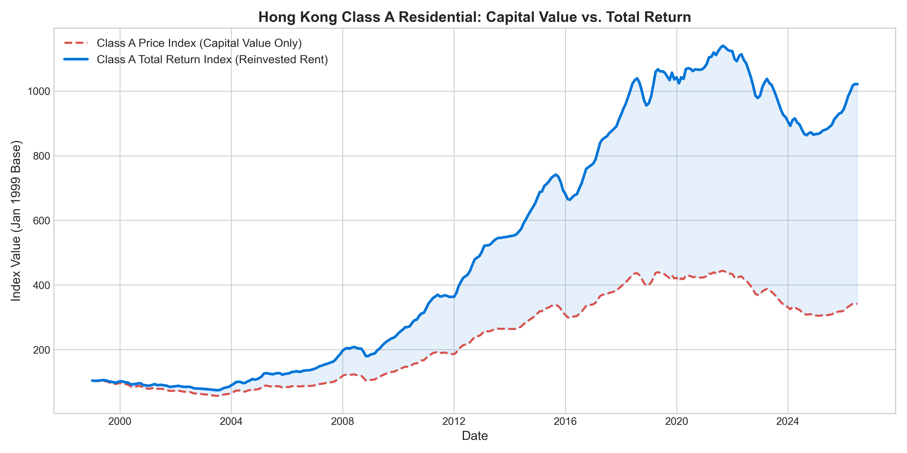
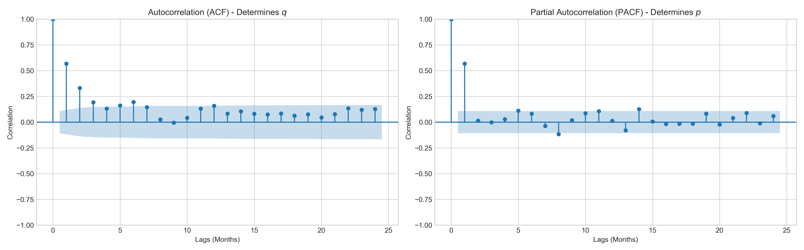

# Hong Kong Residential Property: Total Return Index & ARIMA Forecasting

Standard analysis on Hong Kong real estate indices skew performance metrics by tracking only capital values/price, effectively ignoring the compounding power of rental cash flows. This project constructs a true Total Return Index (TRI) for Hong Kong residential properties (1999–2026) and forecasts future returns using an optimal ARIMA time-series model. 

## 📊 Executive Summary
* **The Problem:** Government-issued Price Indices severely understate the actual accumulated wealth generated by real estate assets. 
* **The Solution:** By merging historical Price Indices with Yield data and applying monthly compounding, this tool generates a Total Return Index across five distinct property classes (Class A to E).
* **Forecasting:** An `ARIMA(1,0,0)(1,0,0)[12]` model projects capital values forward, which are then mathematically recombined with yield assumptions to forecast total future returns.

## 📈 Visualizing the Return Gap
*(The chart below demonstrates how Class A properties appear to have grown 3.3x since 1999 on a pure capital basis, while the Total Return actually exceeds 10x when rental income is reinvested.)*



## ⚙️ Methodology & Financial Engineering

### 1. Data Processing
* **Sources:** Raw CSV datasets (`1.4M.csv` and `5.1M.csv`) retrieved from the [Hong Kong Rating and Valuation Department (RVD) Property Market Statistics](https://data.gov.hk/en-data/dataset/hk-rvd-tsinfo_rvd-property-market-statistics).
* **Transformation:** Annualized yields are converted to monthly cash flow equivalents. Capital returns and income returns are calculated independently before being aggregated into a continuous index.

### 2. Time-Series Forecasting (ARIMA)
* **Stationarity:** An Augmented Dickey-Fuller (ADF) test confirmed the log returns of the Price Index are stationary ($p = 0.0101, d = 0$).
* **Component Separation:** The ARIMA model is trained **strictly on the Price Index (log returns)**. Real estate returns consist of a stochastic component (price) and a deterministic component (yield). Feeding a combined Total Return into the model would introduce artificial smoothing and distort the AutoRegressive parameters.
* **Model Selection:** A grid search identified `ARIMA(1,0,0)(1,0,0)[12]` as the optimal fit, minimizing the AIC while capturing the dominant 1-month momentum ($p=1$) and detecting a statistically significant 12-month seasonal lag.
* **Reconstruction:** Forecasted price returns are converted from log-scale and combined with a baseline yield assumption to generate the projected Total Return Index.



## 💻 Tech Stack
* **Language:** Python
* **Data Manipulation:** `pandas`, `numpy`
* **Quantitative Modeling:** `statsmodels`, `pmdarima`
* **Visualization:** `matplotlib`

## 🚀 How to Run the Project
1. Clone this repository to your local machine.
2. Install the required dependencies:
   ```bash
   pip install -r requirements.txt
